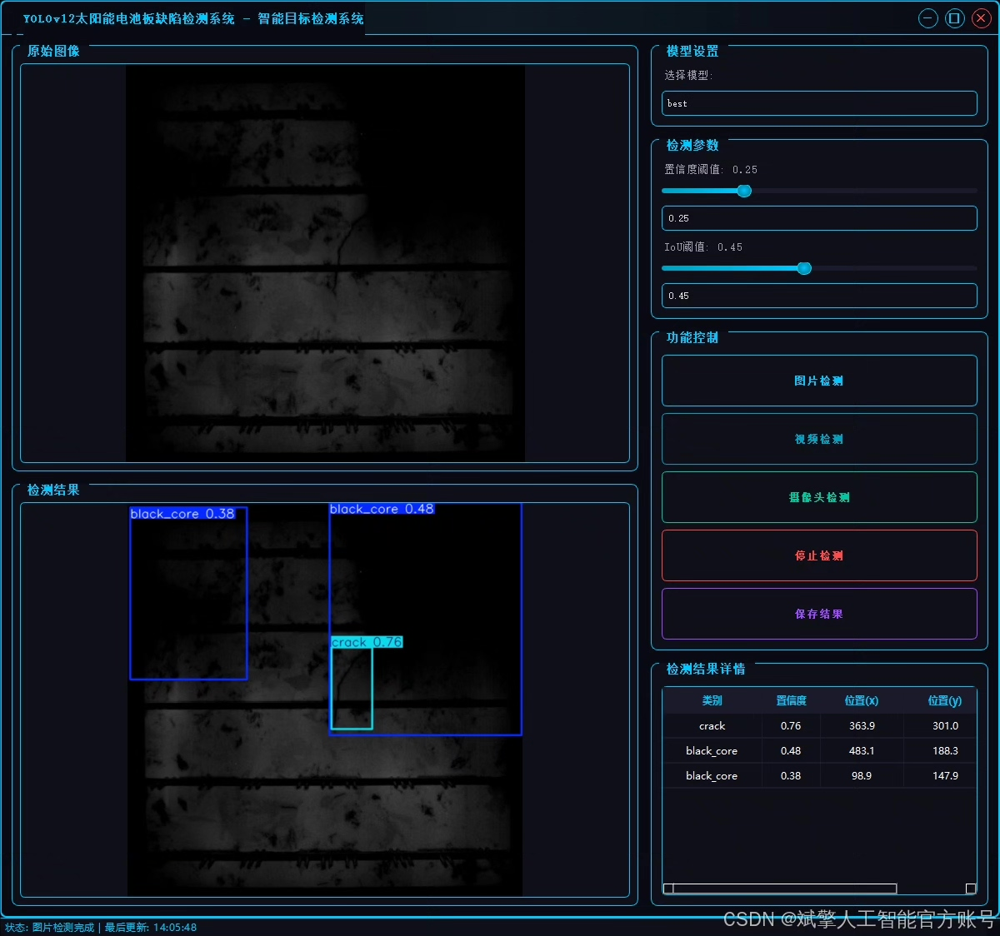
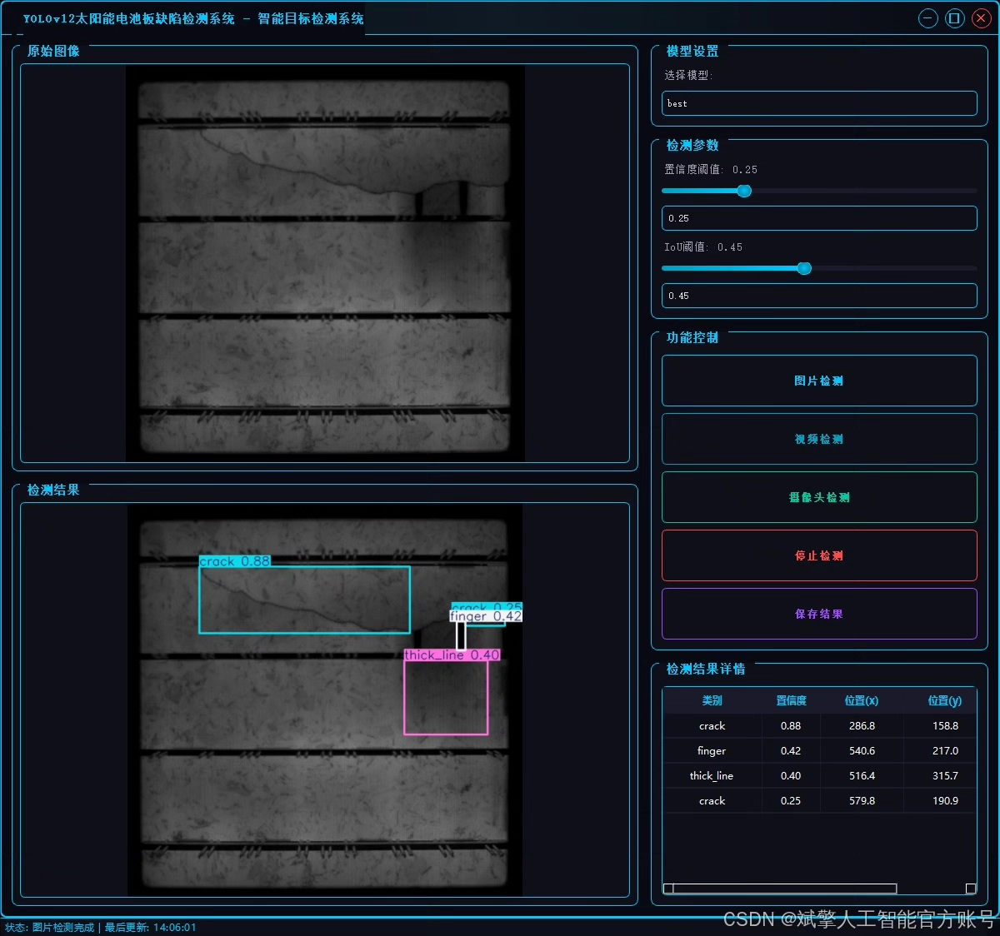
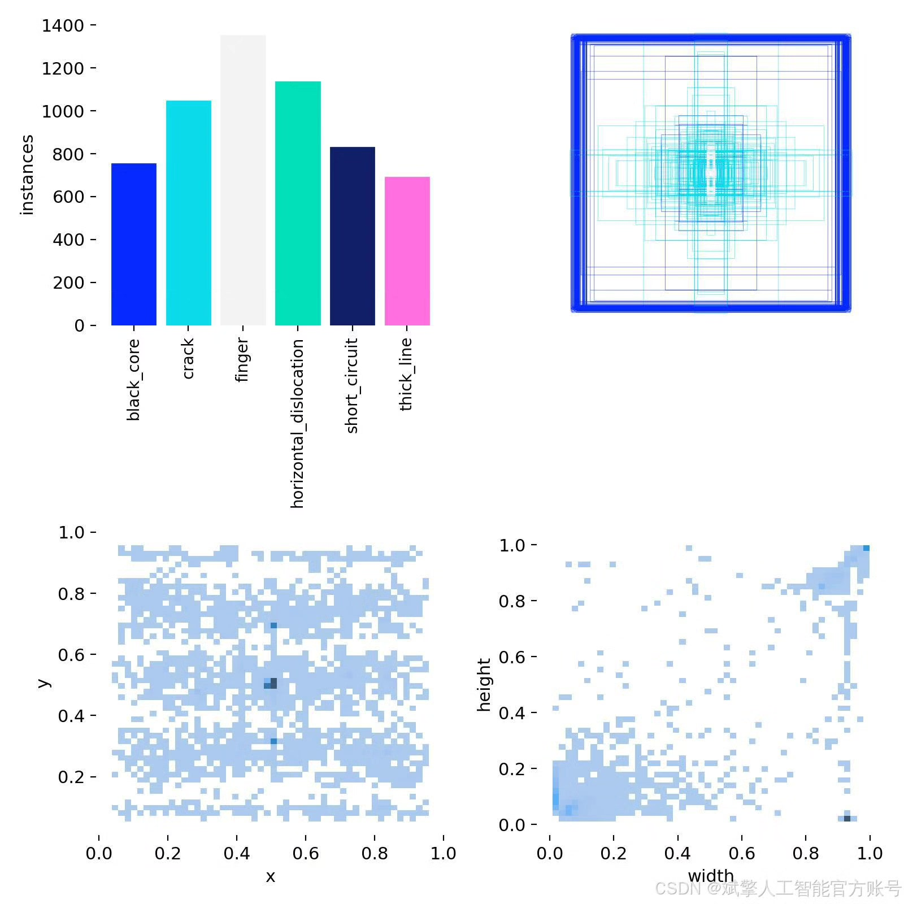
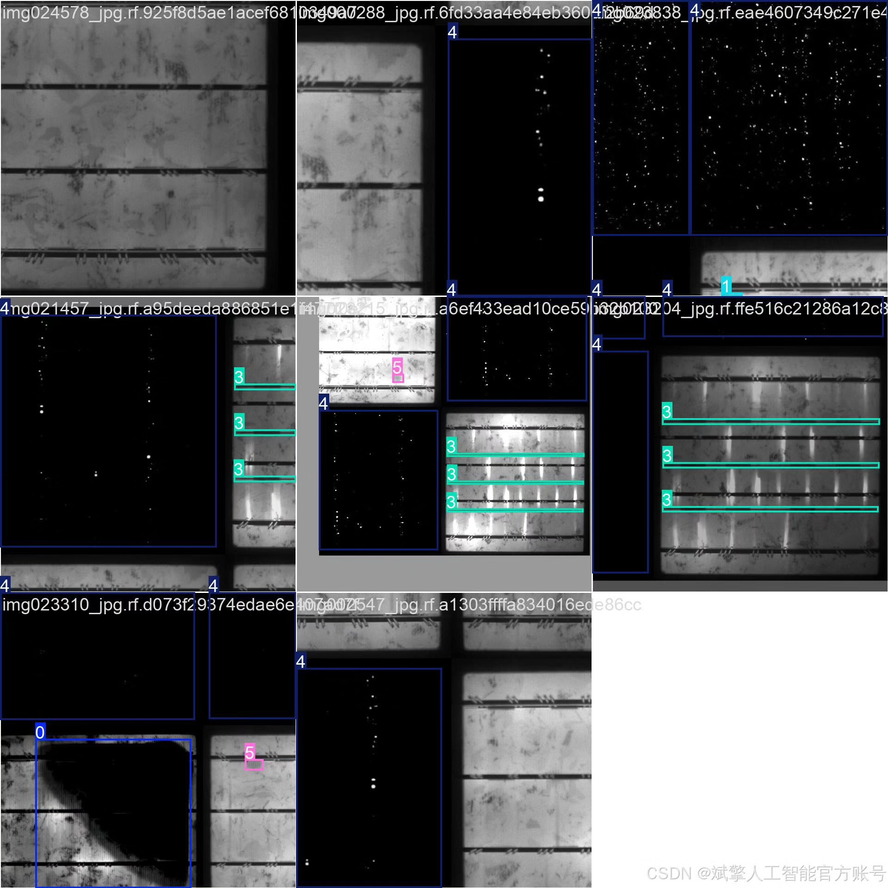
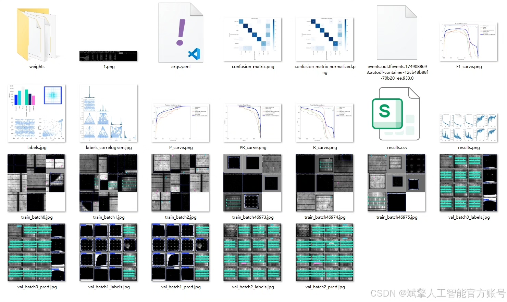
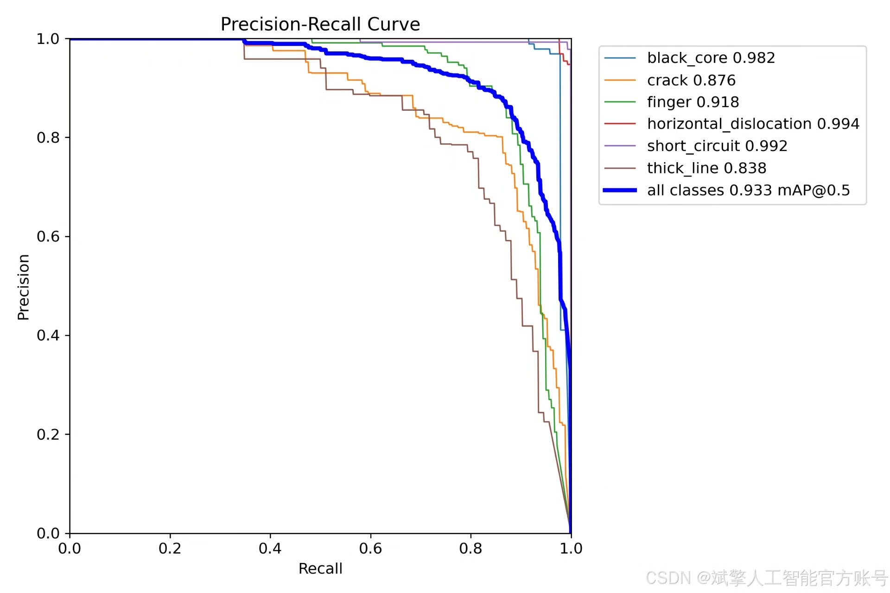
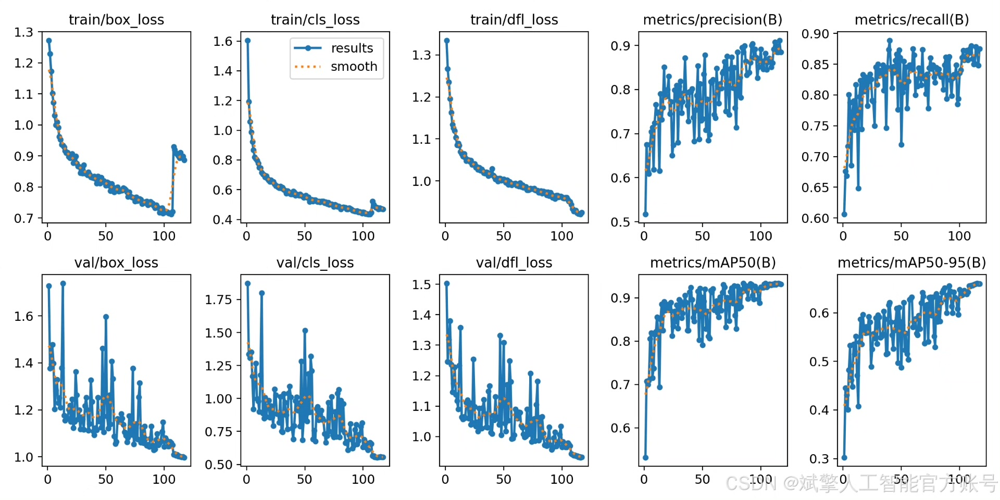

# YOLOv12 Solar Defect Detection System

## Body

YOLOv12 Solar Panel Defect Detection System Based on Deep Learning YOLOv12: A Solar Cell Panel Defect Identification and Detection System (YOLOv12+YOLO dataset + UI interface + login registration interface + Python project source code + model)

With the rapid development of the solar industry, the quality inspection of solar cell panels has become a crucial link in ensuring the efficient operation of photovoltaic systems. Traditional manual detection methods are inefficient and costly, failing to meet the demands of large-scale production. This paper designs and implements an efficient and accurate solar cell panel defect identification and detection system based on the deep learning target detection algorithm YOLOv12. The system can automatically detect six common defects, including black core (black_core), crack (crack), finger-like defect (finger), horizontal displacement (horizontal_dislocation), short circuit (short_circuit), and thick line (thick_line). The experimental data is self-built, consisting of 3512 training images, 502 validation images, and 1002 test images. By optimizing the model structure and training strategy, high accuracy and robustness in defect detection were achieved. Additionally, the system features a user-friendly UI interface with login registration functionality, facilitating industrial deployment and application. Experimental results show that the system achieves high detection accuracy on the test set, providing an intelligent solution for the quality control of solar cell panels.

✅ User Login Registration: Supports password verification and security authentication.
✅ Three Detection Modes: Based on the YOLOv12 model, supports image, video, and real-time camera detection, accurately identifying targets.
✅ Dual-Screen Comparison: Displays the original image and detection results side by side on the screen.
✅ Data Visualization: Real-time table displays the category, confidence, and coordinates of detected targets.
✅ Intelligent Parameter Tuning: Offers a confidence slide bar to dynamically optimize detection accuracy, adapting to different scene requirements.
✅ Sci-Fi Interactive Interface: Dark theme paired with dynamic light effects, reducing visual fatigue and enhancing operational experience.

## Images

## Payment

Here is a pay link on Stripe ( https://buy.stripe.com/3cs8yP7sY87d0vu9AB ). Please contact me lonlonago@foxmail.com after funding $89, and I will send you a complete data files , thank you!

